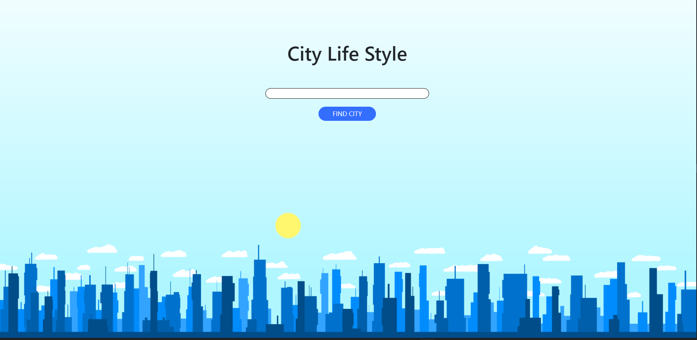
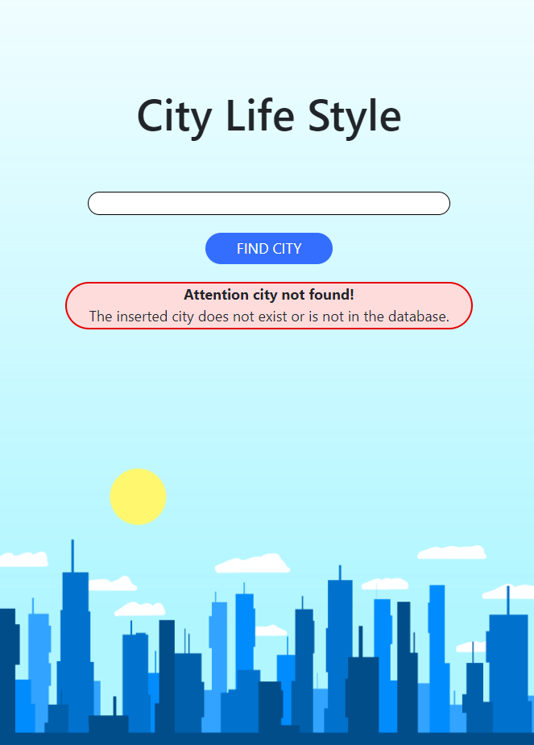
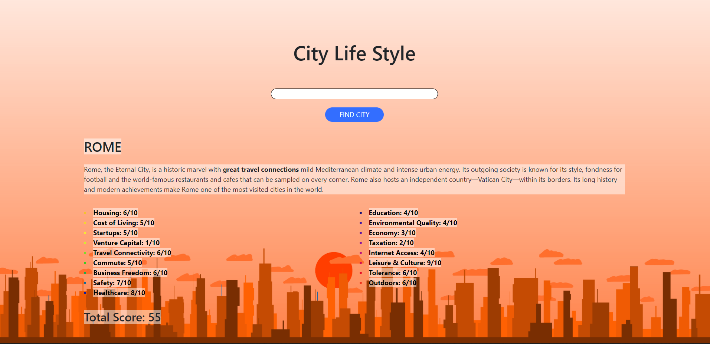
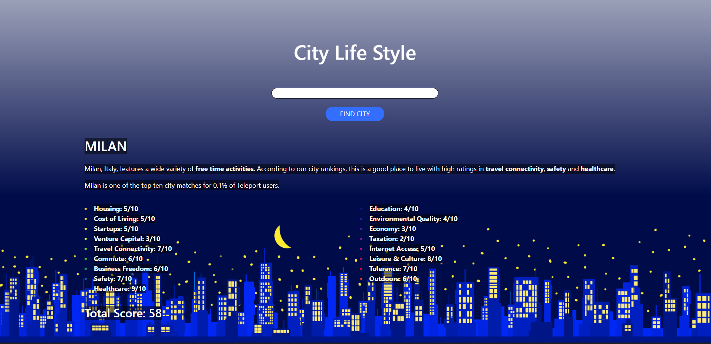

<!-- Intestazione -->

<h1>City LifeStyle</h1>

<!-- Sommario -->

  
Table of Contents

  <ol>
    <li><a href="#about-the-project">About the project</a></li>
    <li><a href="#built-with">Built with</a></li>
    <li><a href="#javascript-functions">JavaScript functions</a>
      <ul>
        <li><a href="#URL">URL builder</a></li>
        <li><a href="#error">Error Message</a></li>
        <li><a href="#cats">Categories builder</a></li>
        <li><a href="#output">Output generator</a></li>
        <li><a href="#fetch">Fetch data</a></li>
        <li><a href="#time">Background changer</a></li>
      </ul>
  </ol>

 

<!-- Informazioni sul progetto -->
## About the project

The main function of the project is to show information about the quality of life of the most important cities in the world. Simply search for the desired city and will show information about housing, cost of living, safety, healthcare, economy and much more.

In case the searched city is not in the database or in case you have entered a wrong value an error message appears.

(<a href="#top">back to top</a>)

 

<!-- Coustruito con -->
## Built with
* [Bootstrap](https://getbootstrap.com)
* [JavaScript](https://www.javascript.com/)

(<a href="#top">back to top</a>)

 

<!-- Componenti JavaScript -->
## JavaScript functions
### URL builder

The getURL(name) function takes the user’s input and creates the URL that will refer to the external server.

### Error Message

The createError() function creates the error message that will be displayed in case of incorrect input or city not present in the database.

### Categories builder

The createCategories(data) function takes the array containing the categories of each city and divides it into two arrays so that you can improve its display. Once the arrays are created, check that the HTML element in which they will be inserted is empty, in order to avoid overwriting, otherwise it empties the element and then appends the new information.

### Output generator

The createOutput(data) function generates the output displayed by the user with the information fetched from the server.

### Fetch data

The fetchData(url) asynchronous function fetch the response from the server. In case the server response is wrong the function generates the error with createError() function. Otherwise it will generate the output with createOutput() function that contains the createCategories() function.

### Background changer

I created three different backgrounds and the backgroundTime() function handles the background of the page depending on the time the page is visited. Also change the style of the text depending on whether the background is light or dark.

(<a href="#top">back to top</a>)

